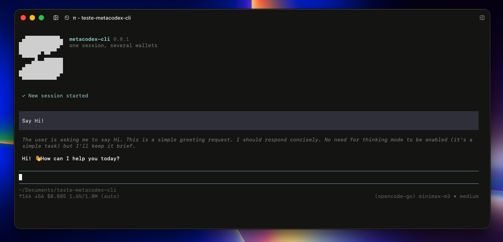

# metacodex-cli (`mcx`)

[English](./README.md)

<p align="center">
  
</p>

CLI de coding agent. Uma sessão, várias carteiras. Anthropic, OpenAI, Codex, OpenCode Zen, OpenCode Go, DeepSeek e Kimi. O produto é o roteador de sessão: fallback visível, handoff que você dispara, subagents isolados.

Não é um fork do [Pi](https://github.com/earendil-works/pi-mono). O motor é o SDK do Pi. A home é `~/.mcx`. Não lê nem grava `~/.metacodex` nem `~/.pi`.

Status: **0.0.1**. Instala por este repo (ainda não está no npm). O motor fica pinado no Pi `0.84.x`. Não rode `pi update`. Quando o motor andar, uma versão nova do `mcx` leva ele.

O app desktop [metacodex](https://github.com/victorbenazzi) continua o shell. Depois ele abre o `mcx` num tab PTY. Este repo é a CLI.

## Por que usar

| Você ganha | Na prática |
|---|---|
| Um harness | Fica na mesma TUI em vez de pular entre Claude, Codex e outro CLI. |
| Carteiras curadas | O `/auth` mostra sete providers. O resto do catálogo do Pi fica no motor, escondido. |
| Fallback visível | 429, 5xx, timeout, overload hopam para a próxima carteira da chain. Máx 2 hops. A TUI avisa `retrying on deepseek (rate_limit anthropic)`. |
| Auth não hopa | 401 / 403 / content policy ficam no modelo atual. Você conserta a chave. A CLI não gasta outra carteira em silêncio. |
| Handoff seu | `/handoff` escolhe o próximo cérebro, instrução opcional, sempre injeta um pacote: o que estava em curso, o que já valeu, o que não refazer. Aí o modelo novo começa. |
| Subagents isolados | O agente chama `spawn`. O filho não herda o transcript do pai. Tools padrão são leitura. Máx 3 ao vivo. Filho não spawna. |
| Skills que você já tem | Carrega `~/.mcx/skills`, `.agents/skills` do projeto, e skills únicas do Claude/Codex (read-only). Nunca escreve em `~/.claude` nem `~/.codex`. |

## Requisitos

- Node.js `>=22.19.0` (o instalador confere)
- Um terminal. macOS ou Linux. Windows: Git Bash ou WSL.
- O pnpm entra sozinho se o Node tiver corepack ou npm

## Instalar

```bash
curl -fsSL https://raw.githubusercontent.com/victorbenazzi/metacodex-cli/main/scripts/install.sh | bash
```

Isso puxa o `install.sh` atual do `main` e baixa a **última GitHub Release** (tag `vX.Y.Z`), roda `pnpm install && pnpm build` e liga o `mcx` em `~/.local/bin/mcx`. Não a ponta do `main`.

```bash
mcx --version    # mcx 0.0.1
mcx --help
```

Se o shell disser `command not found`, coloque `~/.local/bin` no `PATH` e abra um terminal novo:

```bash
export PATH="$HOME/.local/bin:$PATH"
```

Desinstalar (mantém `~/.mcx`: auth, sessões, settings):

```bash
curl -fsSL https://raw.githubusercontent.com/victorbenazzi/metacodex-cli/main/scripts/install.sh | bash -s -- --uninstall
```

Para trunk ou um pin, defina `MCX_REF` (branch, tag ou commit):

```bash
curl -fsSL https://raw.githubusercontent.com/victorbenazzi/metacodex-cli/main/scripts/install.sh | MCX_REF=main bash
curl -fsSL https://raw.githubusercontent.com/victorbenazzi/metacodex-cli/main/scripts/install.sh | MCX_REF=v0.0.1 bash
```

### Instalar de um clone

```bash
git clone https://github.com/victorbenazzi/metacodex-cli.git
cd metacodex-cli
pnpm install
pnpm build
mkdir -p ~/.local/bin
ln -sfn "$(pwd)/dist/cli.js" ~/.local/bin/mcx
```

A home padrão é `~/.mcx`. Override: `MCX_HOME`.

## Atualizar

```bash
mcx update
```

Igual o instalador: instala a última GitHub Release (tag `vX.Y.Z`), rebuilda e religa `~/.local/bin/mcx`. Não mexe em `~/.mcx` (auth, sessões, settings). Não é `pi update`. Main continua o trunk; o canal de quem já tem o binário é a tag.

Não rode `pi update`. O motor do Pi fica pinado. Quando o motor andar, uma versão nova do `mcx` leva ele.

Se o `mcx update` ainda disser que o motor está pinado, esse binário é antigo. Rode o instalador uma vez. Depois disso, o caminho é `mcx update`.

Instalou de um clone? Continue com `git pull && pnpm install && pnpm build`. O `mcx update` troca o symlink pela cópia do GitHub.

## Primeiro uso

```bash
cd seu-projeto
mcx
```

Não tem portão de login. A TUI abre. Conecta uma carteira quando precisar.

1. `/auth` e escolhe o provider.
2. OAuth abre o browser (Codex pode perguntar browser vs device code). API key cola na TUI.
3. Opcional: `/auth fallback` e ordena a chain (exemplo: anthropic, deepseek, kimi).
4. Fala com o agente como em qualquer coding CLI.

Se nada estiver conectado, o status diz `/auth to connect a provider`. Turno sem credencial falha na cara.

### OAuth da Anthropic

OAuth de Claude Pro/Max no `mcx` usa **extra usage** da Anthropic, cobrado por token. Não desconta do plano do jeito que o Claude Code desconta. Extra usage vazio vira HTTP 400. Use **API key** no `/auth`, ou recarregue extra usage em [claude.ai/settings/usage](https://claude.ai/settings/usage).

### Retomar sessão

No quit a CLI imprime:

```text
To resume this session: mcx --session <id>
```

As sessões ficam em `~/.mcx/sessions`. Use `mcx --session`, não `pi --session`.

Print mode (uma shot, sem TUI):

```bash
mcx -p "O que este repo faz? Lê o README.md."
```

## Providers (`/auth`)

| Linha | Auth |
|---|---|
| Anthropic | OAuth (Claude Pro/Max) ou API key |
| OpenAI API | API key |
| OpenAI Codex | OAuth (ChatGPT Plus/Pro) |
| OpenCode Zen | API key |
| OpenCode Go | API key |
| DeepSeek | API key |
| Kimi | OAuth ou API key |

Na mesma tela: conectar, trocar método, sair, editar a chain de fallback.

## Na sessão

| Comando | O que faz |
|---|---|
| `/auth` | Conecta um provider curado, ou edita a chain de fallback. |
| `/handoff` | Escolhe outro modelo conectado, instrução opcional. Sempre injeta o pacote e dispara o turno. |
| `/mcp` | Lista e gerencia servers MCP. Um proxy tool; servers ficam lazy. |
| `/model` | Troca de modelo. Mesma família: só troca. Outro provider: pacote, sem passo de instrução, sem turno automático. |
| `/plan` | Liga/desliga plan mode (Shift+Tab também). Só leitura até você desligar. |

`spawn` é tool do agente pai. Não é slash command.

### Fallback

Configura em `/auth fallback`, grava em `fallback.chain` no `~/.mcx/settings.json`. Chain vazia: retry no mesmo modelo.

Hopa em: 429, 5xx, timeout, overload. Overflow: compacta primeiro; hopa só para janela maior.

Não hopa em: 401, 403, 400, content policy.

Máx 2 hops. Aviso: `retrying on deepseek (rate_limit anthropic)`.

### Pacote de handoff

O modelo seguinte vê de quem veio, o que estava em curso, o que as tools já fizeram, e o que não refazer. A instrução sua é adendo. Nunca substitui o pacote. Tool results no transcript são verdade.

### Subagents (`spawn`)

```
spawn({
  description: string,   // rótulo curto na TUI do pai
  prompt: string,        // brief. obrigatório. o filho não vê o chat do pai
  model?: string,        // "provider/id"
  background?: boolean,  // default false
  tools?: string[],      // default read, bash, grep, find, ls. write/edit opt-in
  skills?: string[]      // allowlist. default nenhuma
})
```

- Máx 3 filhos ao vivo (foreground + background).
- Sem ninho. O filho não recebe `spawn`.
- Abort do pai mata os filhos. Abort do filho não mata o pai.
- Timeout 10 minutos. Sem worktree. Sessões em `~/.mcx/sessions/subagents/`.

### Skills

O pai carrega a união de:

- `~/.mcx/skills` (a skill `mcx` entra no first-run; edição sua não é sobrescrita)
- `<repo>/.agents/skills`
- `AGENTS.md` / `CLAUDE.md` (como o Pi já faz)
- Nomes únicos de `~/.claude/skills`, `~/.codex/skills`, `<repo>/.claude/skills` (read-only)

O filho só leva as skills nomeadas em `spawn.skills`.

## Plan mode (`/plan`)

`/plan` ou Shift+Tab liga um permission-mode de leitura na sessão pai. O footer mostra `plan`.

Passa: `read`, `grep`, `find`, `ls`, e bash claramente read-only (`ls`, `rg`, `git status`, `git log`). Recusa: `write`, `edit`, `spawn`, bash que muta, e outras tools (incluindo o proxy MCP). `/plan off` ou o mesmo toggle sai. Estado é só memória. Sessão nova ou resumed começa com plan off. Thinking cycle fica no `/effort`; Shift+Tab é plan.

## MCP (`/mcp`)

A sessão pai carrega `pi-mcp-adapter` como dependência npm (não `pi install`, não copia para `~/.mcx/extensions`). O modelo vê um proxy tool (~200 tokens), não o catálogo inteiro de MCP. `/mcp` lista e gerencia servers. A config global efetiva é `~/.mcx/mcp.json` porque `PI_CODING_AGENT_DIR` é `~/.mcx`. O adapter também pode ler `.mcp.json` do projeto e arquivos compartilhados (`~/.config/mcp/mcp.json`, `~/.agents/mcp.json`). Writes ficam em `~/.mcx` ou `.pi/mcp.json` do projeto se o adapter já faz isso. Filho do spawn não leva MCP.

## Disco

```text
~/.mcx/                 # ou $MCX_HOME
  auth.json
  settings.json         # theme, fallback.chain, enabledModels
  mcp.json              # override global do adapter MCP (não ~/.pi)
  sessions/
    subagents/
  skills/
  themes/               # metacodex-dark / metacodex-light
```

O `enabledModels` acompanha as carteiras que realmente têm credencial, para a TUI não avisar `openai/*` vazio.

## Desenvolvimento

```bash
pnpm install
pnpm test
pnpm dev          # tsx, mesma home ~/.mcx
pnpm build
```

O contrato do v1 está em [DESIGN.md](./DESIGN.md). Código que divergir disto está errado.

## Release

`MCX_VERSION` em `src/version.ts` é a fonte. O CI não faz bump.

1. Bump de `MCX_VERSION` (mantenha `package.json` no mesmo número) num PR.
2. Merge.
3. Tag `v0.0.x` batendo com essa string e push da tag.
4. O workflow da tag publica uma GitHub Release. Não é npm. Não é binário nativo.

`mcx update` e o instalador (sem `MCX_REF`) instalam essa última release.

## Licença

[MIT](./LICENSE)
